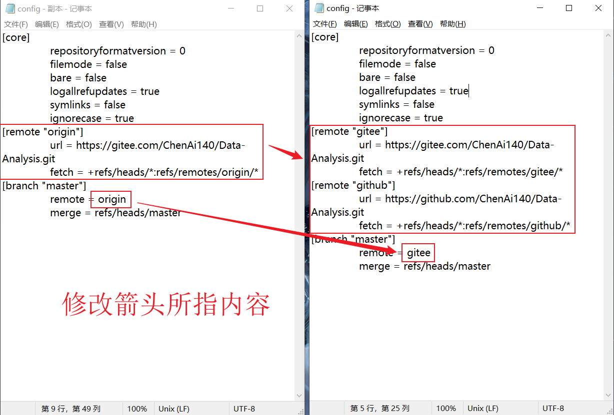

## 暂存
```git
git add .
```

## 提交
```git
# 提交所有修改
git commit -m "some msg" -a

# 提交单个文件
git commit -m "some msg" XXX.txt

# 增补提交（不会产生新的提交历史）
git commit -C head -a -amend
```
## 推送
```git
git push github master

git push gitee master
```
##### github、gitee同步推送

打开隐藏文件，找到目录中的`.git`隐藏文件夹，修改config  



## 拉取


## 强制拉取


---
---

