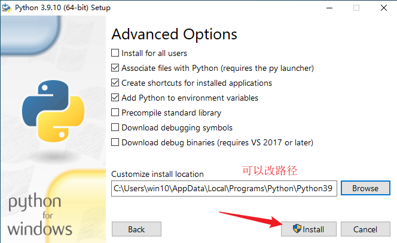
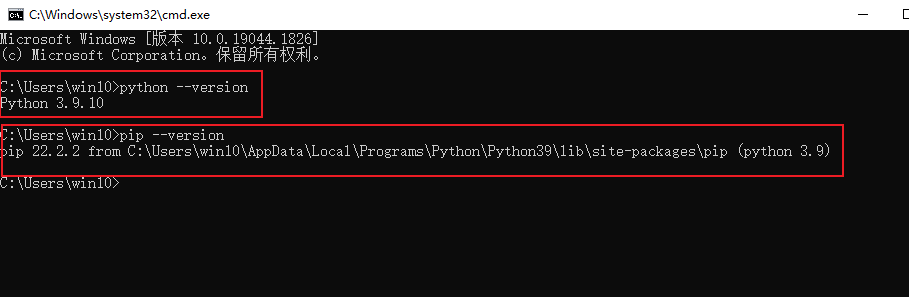

[TOC]

Python 版本：3.9.10  
编程环境：Windows10 专业版  
编程软件：VScode、jupyter notebook  

## 1. Python 的安装

[Python 官网下载地址\_win](https://www.python.org/downloads/windows/)
[Python3.9.10_win](https://www.python.org/ftp/python/3.9.10/python-3.9.10-amd64.exe)

1. 将 Python 添加到环境变量中，自定义安装  
   

2. next  
   

3. 自行修改路径，然后 install  
   

4. 安装完成  
   

5. 检测安装是否成功，运行 cmd，输入 python 显示 python 的版本号即安装成功  
   

### 1.1 配置镜像源

以清华的镜像源为例
运行 cmd 命令提示符，输入以下代码

```txt
pip config set global.index-url https://pypi.tuna.tsinghua.edu.cn/simple
```

**其它常用镜像源**

- 清华：https://pypi.tuna.tsinghua.edu.cn/simple
- 阿里云：http://mirrors.aliyun.com/pypi/simple/
- 中国科技大学 https://pypi.mirrors.ustc.edu.cn/simple/
- 华中理工大学：http://pypi.hustunique.com/
- 山东理工大学：http://pypi.sdutlinux.org/
- 豆瓣：http://pypi.douban.com/simple/

### 1.3 Python 包管理工具(pip)

#### 1.3.1 pip 的使用方法

运行 cmd 命令提示符，输入

```txt
pip install 包名1 包名2 。。。
```

#### 1.3.2 pip 的升级

```txt
pip install --upgrade pip
```

由于各种奇奇怪怪的原因，所以运行这条指令也许会报错

### 1.4 创建虚拟环境

#### 1.4.1 创建虚拟环境

[文章参考](https://blog.csdn.net/u012585708/article/details/120242166?spm=1001.2014.3001.5506)

打开 cmd，先切换盘符，再使用 cd 命令切换到目标路径

```txt
E:
cd E:\Python
python -m venv 虚拟环境名称
```

虚拟环境创建成功后会在目标路径下创建一个虚拟环境的文件夹

#### 1.4.2 激活虚拟环境

1. 进入虚拟环境的Scripts文件夹，输入`activate`，回车即可激活虚拟环境
2. 直接将Scripts文件夹中的`activate.bat`文件拖到cmd中，回车即可激活虚拟环境

#### 1.4.3 在虚拟环境中安装第三方库

- 可以使用 pycharm 进行安装，安装方法自行百度
- 也可以进入虚拟环境的 Script 文件夹，正常安装即可  
  

