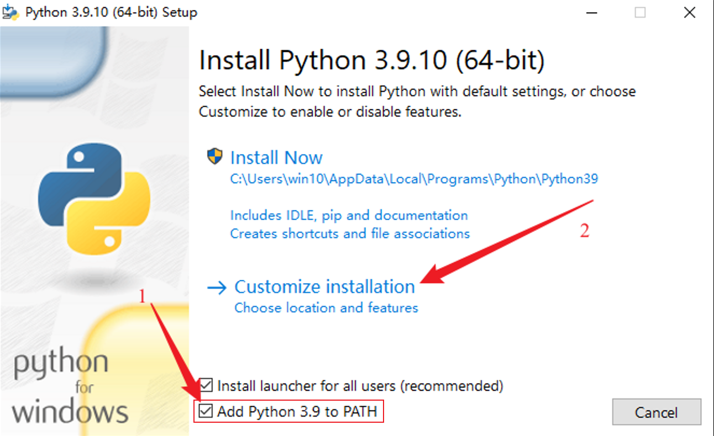
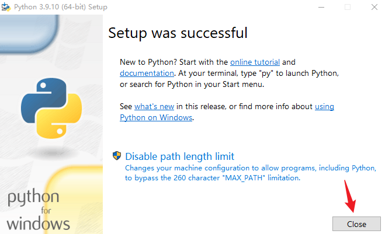
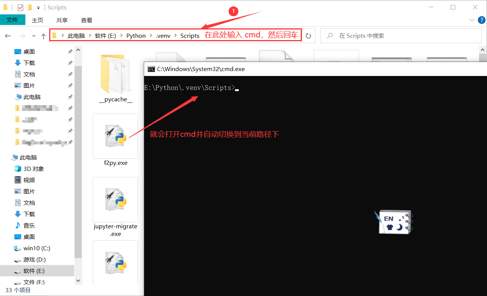

## 一、Python 的安装及配置

[Python 官网下载地址\_win](https://www.python.org/downloads/windows/)  
[Python3.9.10_win](https://www.python.org/ftp/python/3.9.10/python-3.9.10-amd64.exe)

### 1. 安装Python

1. **将 Python 添加到环境变量中，自定义安装**  
      
    <br />
    
2. **确定pip已经勾选上，很重要！下一步next**  
      
    <br />

3. **自行修改路径，然后 install，我这里是虚拟机只有C盘，所以没改路径**  
      
    <br />

4. **安装完成**  
      
    <br />

5. **检测安装是否成功，同时按住<kbd>win</kbd>+<kbd>R</kbd>，输入cmd，按回车，输入`python --version` 和`pip --version`显示 python 和 pip 的版本号即安装成功**  
      
    <br />

### 2 配置镜像源

以清华的镜像源为例  
运行 cmd 命令提示符，输入以下代码  

```shell
pip config set global.index-url https://pypi.tuna.tsinghua.edu.cn/simple
```

**其它常用镜像源**

- 清华：https://pypi.tuna.tsinghua.edu.cn/simple
- 阿里云：http://mirrors.aliyun.com/pypi/simple
- 中国科技大学 https://pypi.mirrors.ustc.edu.cn/simple
- 华中理工大学：http://pypi.hustunique.com
- 山东理工大学：http://pypi.sdutlinux.org
- 豆瓣：http://pypi.douban.com/simple

<br />

## 二、 Python 包管理工具(pip)的使用

### 1. pip 安装第三方包

运行 cmd 命令提示符，输入  

```shell
pip install 包名1 包名2 。。。
```

**注意**：直接从cmd安装会安装到Python的主环境中，但我们一般都是使用Python的虚拟环境来运行我们的代码。

### 2. 升级 pip

```shell
# 直接更新pip
pip install --upgrade pip

# 更安全的更新pip方法，亦可更新虚拟环境中的pip
# cmd进入python.exe所在路径，运行下面的指令
python.exe -m pip install --upgrade pip

# 又或者使用相对路径、绝对路径更新
路径/python.exe -m pip install --upgrade pip
```

由于各种奇奇怪怪的原因，所以运行这条指令也许会报错  

如果报错，请自行百度


## 三、 创建激活虚拟环境

### 1. 创建虚拟环境

[文章参考](https://blog.csdn.net/u012585708/article/details/120242166?spm=1001.2014.3001.5506)  

打开 cmd，先切换盘符，再使用 cd 命令切换到目标路径  

```shell
# 不需要切换路径的可以跳过
E:
cd E:\Python

# 使用Python自带的包创建虚拟环境
python -m venv 虚拟环境名称
```

虚拟环境创建成功后会在目标路径下创建一个虚拟环境的文件夹    

Pycharm创建项目的同时也可以创建虚拟环境（适合项目开发）  

### 2. 激活虚拟环境

1. 进入虚拟环境的Scripts文件夹，输入`activate`，回车即可激活虚拟环境  
2. 直接将Scripts文件夹中的`activate.bat`文件拖到cmd中，回车即可激活虚拟环境  

### 3. 在虚拟环境中安装第三方库

- 可以使用 pycharm 进行安装，安装方法自行百度  
- 也可以激活虚拟环境后再安装第三方库  

快速打开cmd，并切换路径  
  
<br />

## 四、 安装和配置VScode

### 1. VScode的安装

VScode安装没什么需要注意的，按提示安装即可  

### 2. VScode安装Python插件

VScode想要运行Python代码还需要安装Python插件才可以。  

1. VScode中文插件


2. Python插件


&emsp;&emsp;安装Python插件会自动安装一些附带的插件，都是会用到的，不用担心。  

&emsp;&emsp;如：jupyter(交互式代码编辑工具)、Pylance(Python代码提示工具)等等。  

