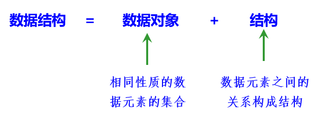

## 第一章 绪论

### 一、数据结构的定义  
> 用计算机解决问题的基本步骤
> 1. 分析问题，确定数据模型。
> 2. 设计相应的算法。
> 3. 编写程序，运行并调试程序直至得到正确结果。

1. **数据**是描述客观事物的数、字符以及所有能输入到计算机中并被计算机程序处理的符号的集合。  

2. **数据元素**是数据的基本单位(例如：A班中的每个学生记录都是一个数据元素)，也就是说数据元素是组成数据的、有一定意义的基本单位，在计算机中通常作为整体处理。  

3. **数据项**：是具有独立含义的数据最小单位，也称为成员或域（例如，A班中每个数据元素即学生记录是由学号、姓名、性别和班号等数据项组成）。  
    

4. **数据对象**：是性质相同的有限个数据元素的集合，它是数据的一个子集。  
    > 如大写字母数据对象是集合C={'A'，'B'，'C'，…，'Z'}；1～100的整数数据对象是集合N={1，2，…，100}。   
    > 默认情况下，数据结构中的数据都指的是数据对象。  

5. **数据结构**是指所涉及的数据元素以及数据元素之间的关系，可以看作是相互之间存在着特定关系的数据元素的集合。可时把数据结构看成是带结构的数据元素的集合。  
    
    
    > **数据结构**是指计算机处理的数据元素的组织形式和相互关系。  
    > **数据类型**是某种程序设计语言中已经实现的数据结构。  
    > 数据结构中讨论的元素关系主要是指**相邻关系**或**邻接关系**。  
    
6. 数据的**逻辑结构**：数据元素之间的逻辑关系。  
    > 数据的逻辑结构是面向用户的，它反映数据元素之间的逻辑关系而不是物理关系。
    > 数据的逻辑结构是独立于计算机的。

7. 数据的**存储结构（或物理结构)**。：数据元素及其关系在计算机存储器中的存储方式。  

8. **数据运算**：施加在该数据上的操作。  

9. **前驱元素**和**后继元素**：两个相邻元素A、B，A是B的前驱元素，B是A的后继元素。  

10. **开始元素**和**终端元素**：若某个元素没有前驱元素，则称该元素为开始元素；若某个元素没有后继元素，则称该元素为终端元素。  

### 二、数据的逻辑结构

1. **集合**：结构中数据元素之间除了“同属于一个集合”的关系外，没有其他关系。和数学上的集合概念相同。  

2. **线性结构**：若结构是非空的，则有且仅有一个开始元素和终端元素，并且所有元素最多只有一个前驱元素和一个后继元素。  

3. **树形结构**：若结构是非空的，则有且仅有一个元素为开始元素（也称为根结点），可以有多个终端元素，每个元素有零个或多个后继元素，除开始元素外每个元素有且仅有一个前驱元素。  

4. **图形结构**：若结构是非空的，则每个元素可以有多个前驱元素和多个后继元素。  
    

5. **顺序存储结构**  
    - 所有元素存放在一片地址连续的存储单元中。
    - 逻辑上相邻的元素在物理位置上也是相邻的，所以不需要额外空间表示元素之间的逻辑关系。

6. **链式存储结构**  
    - 数据元素存放在任意的存储单元中，这组存储单元可以是连续的，也可以是不连续的。
    - 通过指针域来反映数据元素的逻辑关系。

    > 在软件开发中，人们设计了各种存储结构。归纳为4种基本的存储结构。
    > 顺序存储结构
    > 链式存储结构
    > 索引存储结构
    > 哈希（散列）存储结构

### 三、数据的运算

- 将数据存放在计算机中的目的是为了实现一种或多种运算。
- 运算包括**功能描述**（或运算功能）和**功能实现**（或运算实现）。
- 前者是基于逻辑结构的，是用户定义的，是抽象的。
- 后者是基于存储结构的，是程序员用计算机语言或伪码表示的，是详细的过程，其核心是设计实现某一运算功能的处理步骤，即算法设计。

    > 同一逻辑结构可以对应多种存储结构。
    > 同样的运算，在不同的存储结构中，其实现过程是不同的。

### 四、数据结构和数据类型

- **数据类型**是一组性质相同的值的集合和定义在此集合上的一组操作的总称。  
- **数据结构**是指计算机处理的数据元素的组织形式和相互关系，而**数据类型**是某种程序设计语言中已实现的数据结构。  

    > 在程序设计语言提供的数据类型支持下，就可以根据从问题中抽象出来的各种数据模型，逐步构造出描述这些数据模型的各种新的数据结构。

&emsp;&emsp;**抽象数据类型**（ADT）指的是从求解问题的数学模型中抽象出来的数据逻辑结构和运算（抽象运算），而不考虑计算机的具体实现。  

### 五、算法及其描述

1. **算法**是对特定问题求解步骤的一种描述，它是指令的有限序列。  
2. 算法的五个**特性**
    - **有穷性**：指算法在执行有限的步骤之后，自动结束而不会出现无限循环，并且每一个步骤在可接受的时间内完成。
    - **确定性**：对于每种情况下执行的操作，在算法中都有确定的含义，不会出现二义性。并且在任何条件下，算法都只有一条执行路径。
    - **可行性**：算法的每条指令都是可执行的，即便人借助纸和笔都可以完成。
    - **输入性**：算法有零个或多个输入。大多数算法中输入参数是必要的，但对于较简单的算法，如计算1+2的值，不需要任何输入参数，因此算法的输入可以是零个。
    - **输出性**：算法至少有一个或多个输出。算法用于某种数据处理，如果没有输出，这样的算法是没有意义的，算法的输出是和输入有着某些特定关系的量。
    

### 六、知识回顾

### 七、Python

略
